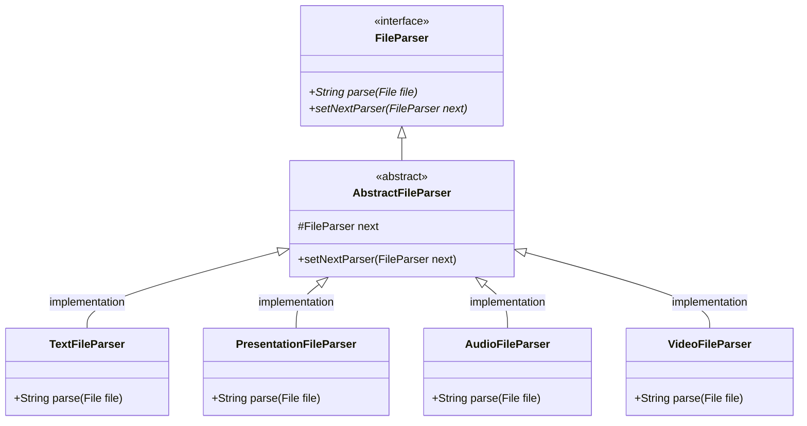

# A gentle introduction to functions.

### The intended audience: `Beginner level`

### What is the article about:
Focus on the most trivial part of functional programming(FP) .i.e functions and function composition. Though FP is all about function composition but can also include other advance elements. 
An attempt is made not to specify any FP jargon but at times it might come up to name something or may be better name it.

### Why another blog on FP:

FP is a very broad topic, and there is a ton of material available online to make you explain about things like type classes, Monads, Effects and what not. 
* There is a need also to highlight how to compose our solutions using simple functions.
* Most of the material revolves around concepts from `Category theory`. Obviously it's very interesting but for a developer, new to FP can be overwhelming and at times might kill the curiosity.
* Focus of the article is to understand functions, solve simple problems using function composition. Doing so we might touch only a subset of FP concepts. 
* The idea is to discuss writing simple composable solutions, at least for start and once you are comfortable, then there are a ton of other materials on your fingre tips(obviously Internet) to get familiar with the FP concepts.
* Nevertheless, just put all the thoughts/experience which I had about programming with functions.
* Most important it is fun!

### Programming Language & Complexity:
The examples are in scala, but can be demonstrated in any other programming language which supports creating and composing functions.

Complexity is a very subjective topic, it might be because of many reasons. There is no point listing those here. The confusion which I want to specifically callout here is `not knowing is not equal to complex`, say it syntax or a concept. Initially there might be hiccups once you overcome those then there is no turning back.

There is an attempt in the blog to make it programming language agnostic. Using examples in scala forces us to be aware of some syntax of scala. Saying that all the required syntax will be covered in the blogs and that is one of the reason why the articles might be a bit lengthy.

### Introduction:

What we are expecting from this first blog, is getting acquainted with the necessary tooling required to get started writing code with functions. As [Bartosz Milewski](https://bartoszmilewski.com/) correctly pointed out to magic number [7+/-2](https://en.wikipedia.org/wiki/The_Magical_Number_Seven,_Plus_or_Minus_Two), basically it talks about human capacity on processing information in sort term. Inspired from that the articles also follow a kind of thumb rule, that no more than 5 concepts introduced at a time, and then we will just play around ideas/thoughts/concepts/techniques.

Let's pick the first handful of things which we want to cover in this blog.
1. Understanding functions part 1 
   * Part 1 because we might keep on explaining more and more about it later.
   * This topic itself will cover a couple of new things.
   * There might be a lot of scala specific discussions, w.r.t syntax and internals about functions.
2. Passing and returning a function.
3. Example usage and abstractions based on what we learnt from #1 and #2

#### Understanding functions part 1:

---
Start with a couple of diagrams (taken from wiki). 
Diagram below: If X is a set of shapes and Y is a set of colours then the relation between these two sets is what we call a function.


Another diagram: Gives an idea of how you can picture what a function can be. If `f` is a function then for a given value `x` it produces a result `f(x)`.


May be writing it in a programming language will help to understand better. Then here is a simple example of a function in scala.


The syntax might be a bit overwhelming, specially if you are new to scala.
But stay with me, once you get familiar it'll become a second nature.
From the above example, the function creation can be divided into three parts.
1. **Name of the function** `doubleIt` created using the `val` keyword. 
   * In general, we can pass data (here by data I mean an object or primitive type) to a function or assign data to a variable or return data from a function as return type. Example:

```scala
/*
 Method accepting some data, processes it and responds with data.
 Input: List of tags in the form of strings.
 Output: List of images which matched the given tag list.
*/
def searchByTags(tags:List[String]):List[Image] = {
/*
Here we created a method using `def` keyword.
Method's cannot be passed and returned like functions.
But scala provides a way to convert methods to functions (ETA expansion, really not important as of now.), blurring the line between methods and functions.
May be for simplicity we can think those are same things with different syntax.
*/
}
//for comparison will write the doubleIt function with def keyword.
def doubleIt(a:Int):Int = 2 * a

//A list of values (data) assigned to a variable.
val tags = List("flowers", "garden", "outdoor")
```
   * In scala(FP languages) apart from data we can also pass, return or assign variables with functions. This is always difficult to visualize at first, specially if new to functional programming. But that's the entire goal of the blog series to make you start thinking in terms of functions. 
   * There is a colon after the function name `val doubleIt :` which indicates that the type of this variable follows it. In our case the type is not a simple `Int`, `String`, `Double`, etc. but a function type.
2. Next the **function type** `Int => Int`. 
   * In simple words a function which takes an `Int` and returns an `Int`
   * Anything on left of `=>` is the input to the function and to right of `=>` is the output type.
   * This is basically a `syntactic sugar`, and to not push it further and keep things simple we will go into what goes behind the scene, later on in the blog.
   * Again the syntax is a bit obscure for beginners, but if you visualize in terms of the images which we saw earlier.
3. The function body, or the **implementation** part. `x => x + 2`
   * It is kind of similar to what we saw in the type signature above #2. with a difference that the left and right side of the `=>` were types and now in #3 those are values(or variables containing values).
   * In the code examples we will always see left of `=` is a type and right of `=` is a value.
   * Here value is basically a function implementation, we could have written `(x:Int) => x * 2`. But because we mentioned a type signature we no longer need to.
   * Again left of `=>` is input and right of `=>` is our put.
   * The right of `=>` is multiplication operation, for example calling `doubleIt(3)` will result to a value `6`
   * If all this made sense and if you are ready to dive further than congratulations! we are going to start a real fun ride soon.  

It's obvious that next example will be a function with two parameters.


1. **Name of the function**, the above explanation applies here, so we are good.
2. **Function type** is a bit different as it takes two parameters now `(Int, Int) => Int`
   * In order to pass two parameters we can group them in parentheses `(Int, Int)`
   * Apart from that all the other parts remain the same.
   * Obviously we can create function with different types for example `(String, Int) => Double`. But for simplicity same types in example.
   * Also, there are other ways to pass multiple parameters to functions, we will discuss that in next point.
   * I'm sure if we want to pass three parameters you know what the type and implementation syntax might be. If yes then cool, and if no then don't worry we will see some examples soon.
3. There is not much to discuss in terms of **implementation** as well, everything which we discussed in first example applies here too.

Now let's check a variant, similar to what we wanted to achieve in above example but with a more powerful way.
Why more powerful, well we will discover that soon.


1. **Name of the function**, the first example function explanation applies here, so we are good.
2. **Function type** is a bit different it takes two parameters but separated by an arrow again `Int => Int => Int`
   * This defies the basic meaning of `=>` we understood until now. Initial understanding was the left of arrow is input and the right of arrow is output.
   * Don't worry it does not in fact you can still think the same way, just that the outcome not is different. `Int => Int => Int` the left of first arrow is an `Int` and the right of first arrow is `Int => Int`.
   * That means it takes an integer, and it returns a function `Int => Int`.
   * So for example. 
```scala
  val add : Int => Int => Int = x => y => x + y
  val add2: Int => Int = add(2) // returns a function
  //calling add2 results
  add2(3) //results 5
  add2(5) //results 7
```
   * What we have achieved here is a very powerful construct in FP, we can apply a function partially by passing only one parameter and fix it to value 2 (in our case) and then call the partially applied function with different values.
   * Such kind of functions where you can pass partial one argument at a time which helps to apply function partially is called [curring](https://en.wikipedia.org/wiki/Currying). Not really important to remember the name but the idea is very useful.  
   * Obviously there can be more than two arguments in a function so for example it can be
```scala
   val makeEmployee: Int => UUID => String => Employee = 
      age => uuid => name => ???
``` 
   * One more advantage of having functions taking one argument at a time helps to identify which set of arguments are repeating in multiple functions and abstractions can be built on top of it. This could be a bit advance thing but yeah we will get back to this interesting use case later in the article.
3. There is not much to discuss in terms of **implementation** as well, everything which we discussed in first example applies here too.
   * But again for the sake of surety that the understanding is confirmed. The implementation is just following the type signature include number of variables and then the implementation after the last `=>` i.e `x + y`

#### Passing and returning a function
Before we move forward let's do a recap.
   1. we can assign functions to variables.
   2. that means we can treat them as values.
   3. it in turn means we can pass function values to other functions just as any other value.
   4. Functions can be applied partially if we create functions which take one argument at a time (function curring).

Getting back to the concept of passing function as argument and returning function as return type, the thought itself makes the brain scratch. What that means is passing and returning behaviours.


Passing and returning values is easy to think about because it is all concrete. But passing and returning functions/behaviours, since it is abstract you need to expand your imagination and broaden the way you use to think about code. But the question is how ? well lets checkout an example. 

To give an example is always a tough ask, specially if you want the reader to relate and understand the problem in hand. For that reason we are going to pick a pattern example from the `Gang-of-Four Design Patterns` book which I'm sure most of the readers are aware if you are coming from an OOP background. Let's take an example of `Chain of responsibility` pattern. For GoF way of solution can be found here [Chain of responsibility](https://github.com/mariofusco/from-gof-to-lambda/blob/master/src/main/java/org/mfusco/fromgoftolambda/examples/chainofresponsibility/ChainOfRespGoF.java). 


Probably the above class diagram is enough to explain what example we are going to implement, the only details missing in the diagram is the part where all the objects are created and the parse functions are called (Main method). The link shared above for the java implementation already contains the entire code implementation. 
In short the input object which is a file goes through all the implementations like a chain one by one from each parse implementation. The one which matches the file type applies the parse functionality. Now let's do this using functions. 

Assumption:
   File object is something like this [File](https://github.com/mariofusco/from-gof-to-lambda/blob/master/src/main/java/org/mfusco/fromgoftolambda/examples/chainofresponsibility/File.java)

```scala
/*
We will start by defining our own custom return type of functions
*/
enum FileParserResult:
  case Success(content:String)
  case GoNext
  case Failure(errorMsgs:String)
 
//instead of creating interfaces and implementations we will replace them with functions
def textParser:File => FileParserResult =
   file => {
      Try {
         if file.getType == File.Type.TEXT 
         then FileParserResult.Success(file.getContent())
         else FileParserResult.GoNext  
      } match {
         case Success(result) => result
         case Failure(err) => FileParserResult.Failure(s"Failed due to error ${err.getMessage}")
      }
   }
```

Explanation: here `Try` is similar to the enum type `FileParserResult` we are using with a difference that it actually wraps code in a `try catch` block. Why we need `Try` is because if calling a 3rd party API we are not sure what errors it might throw. One more difference compared to `FileParserResult` is it contains only two types `Success` and `Failure` while in our case we have the third enum value `GoNext` soon we will see how it is used.

We could go ahead and implement other methods analogs to other implementations of `AbstractFileParser`. But it seems to be repetitive code. With a minor difference of the file type check. So let's refactor the textParser to be a bit generic.

```scala
def parser:FileType => File => FileParserResult =
   fileType => file => {
      Try {
         if fileType == File.Type.UNKNOWN
         then FileParserResult.Failure(s"The File type is not supported.")
         else if file.getType == fileType 
         then FileParserResult.Success(file.getContent())
         else FileParserResult.GoNext  
      } match {
         case Success(result) => result
         case Failure(err) => FileParserResult.Failure(s"Failed due to error ${err.getMessage}")
      }
   }
   
//So we can basically now do something like this.
val textFileParser = parser(File.Type.TEXT)
val presentationFileParser = parser(File.Type.PRESENTATION)
val audioFileParser = parser(File.Type.AUDIO)
val videoFileParser = parser(File.Type.VIDEO)
/*
It is interesting to check how partial application of function
works like a wonder.
*/

textFileParser(myFile) //this will parse for text or
videoFileParser(myFile) //this for video or
audioFileParser(myFile) //for audio, and so on

```
Next step is to write a function to compose all these functions. More like a main function. We can do this in many ways. Here we take a naive approach, and then we can start building and refactoring on top of it.
```scala
//First Try
def composeFileParser(file: File): FileParserResult = {
   val textResult = textFileParser(myFile)
   textResult match {
      case FileParserResult.GoNext =>
         val audioResult = audioFileParser(File.Type.AUDIO)
         audioResult match {
            case FileParserResult.GoNext =>
               val videoResult = videoFileParser(File.Type.VIDEO)
            /*
             We will end up with a crazy nested pattern matching
             Or an if else conditions.
            */
            case failureOrSuccess =>
               failureOrSuccess
         }
      case failureOrSuccess =>
         failureOrSuccess

   }
}

//A little better way 
//when we did these calls
val textFileParser: File => FileParserResult = parser(File.Type.TEXT)
val presentationFileParser: File => FileParserResult = parser(File.Type.PRESENTATION)
val audioFileParser: File => FileParserResult = parser(File.Type.AUDIO)
val videoFileParser: File => FileParserResult = parser(File.Type.VIDEO)
//one thing was pretty clear inorder to compose this solution
//We need to be able to compose function of 
// type File => FileParserResult
//Again writing functions which take one argument at a time (curried)
//Helped to understand the repetition of types and we 
// can easily understand what type needs to be abstracted.

//Again what we learned so far is function are values/object in FP languages.
//In case of scala if it is a value we can use them as 
//fields of a class, just like any other value type.

//we can create classes like this, name and age are properties 
// of the object Person.
case class Person(name:String, age:Int):
  def isMinor:Boolean = age < 18
//We create Person object instance by calling the constructor
val person = Person("SomePerson", 30)
//call the method
person.isMinor

//similarly we can have a case class with a function as a field 
// and have methods within it.
case class ParserCompose(run: File => FileParserResult):
   def andThen(nextFunction: File => FileParserResult): ParserCompose = 
      ParserCompose {
       file =>
          run(file) match {
            case FileParserResult.GoNext =>
               nextFunction(file)
            case errorOrSuccess =>
               errorOrSuccess
         }
     }
/*
What we did inside the compose function might be confusing.
could be because of syntax, specially 
how to write an anonymous function. We will see a more detailed
explanation later, for now if you did not get it 
ignore the implementation and just try to get on the idea.
Basically all the required wiring of composition we moved 
at one place, inside ParserCompose.

Here is how we can use the ParserCompose 
*/


def mainParser1(myFile:File) : FileParserResult = 
   ParserCompose(parser(File.Type.TEXT))
     .andThen(parser(File.Type.PRESENTATION))
     .andThen(parser(File.Type.AUDIO))
     .andThen(parser(File.Type.VIDEO))
     .andThen(parser(File.Type.UNKNOWN))
     .run(myFile)

//calling main
mainParser1(new File("Creating a dummy file object"))

/*
This composition looks so much better, but we can improve more
It is very specific to scala syntax, but I assume other
languages might also have some kind of mechanism to achieve this

By just adding implicit in front of class declaration, we can make 
a syntax class.
*/

implicit class ParserComposeOps(func: File => FileParserResult):
   def >>>(nextFunction: File => FileParserResult): ParserCompose =
      ParserCompose {
         file =>
            func(fileType) match {
               case FileParserResult.GoNext =>
                  nextFunction(fileType)
               case errorOrSuccess =>
                  errorOrSuccess
            }
      }

val mainParser2:File => FileParserResult =
   parser(File.Type.TEXT) 
    >>> parser(File.Type.PRESENTATION) 
    >>> parser(File.Type.AUDIO) 
    >>> parser(File.Type.VIDEO) 
    >>> parser(File.Type.UNKNOWN)
           
//how to call
mainParser2(myFile)

```